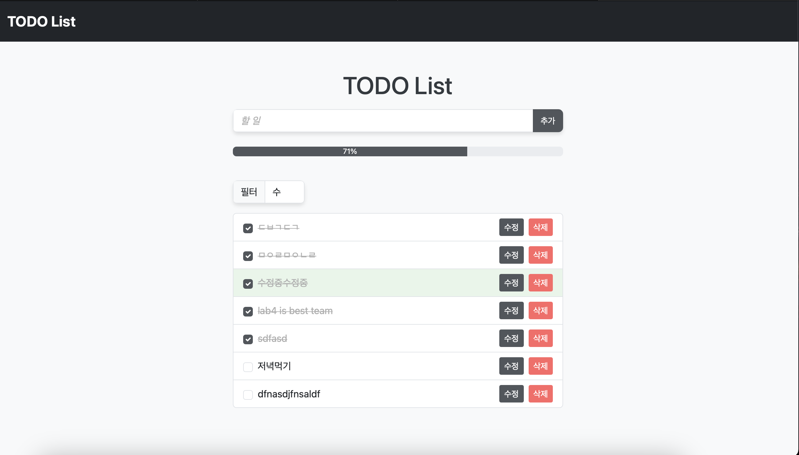

# lab4_todolist

# Crew
1. 이재용
2. 이민서
3. 정보경

# Project

## summary

# Essential functions
1. 할 일 추가 (Create)
    사용자가 입력창에 할 일을 작성하고, ‘추가’ 버튼을 누르면 목록에 새로운 할 일이 생성된다.
2. 할 일 표시 (Read)
    현재까지 등록된 할 일 목록을 화면에 표시한다.
    각 할 일의 완료 여부를 확인할 수 있는 방식(체크박스 등)을 제공한다.
3. 할 일 수정 (Update)
    등록된 할 일을 수정할 수 있는 기능.
    더블클릭하여 편집 모드로 전환, 혹은 수정 버튼 클릭 후 텍스트 변경.
4. 할 일 삭제 (Delete)
    등록된 할 일을 목록에서 삭제할 수 있는 기능.

# Additional functions

1. Filter & Search
    필터링 입력창을 구현하고 이에 맞는 단어를 가진 할 일 목록 배경색 변경
2. Error handling
    입력 창이 비어 있을 때 추가 버튼을 누르면 에러 메시지나 알림 제공
3. Progress bar 
    완료한 투두 수에 기반해서 프로그래스 바 생성

# Stack
1. HTML
2. CSS
3. JavaScript
4. BootStrap
5. LiveShare

# 회고

## 좋았던 점
1. 깃 활용 연습을 모두가 충분히 해볼 수 있었다.
2. 결과물이 예쁘게 잘 뽑혔다.
3. 프로그래스바 애니메이션 적용
4. 팀원들이 함께 요구사항을 정리하고 구현 방법을 논의하는 과정에서 협업 방법에 대해 조금은 배울 수 있었다.

## 아쉬웠던 점
1. 화면이 작아지면 요소들이 깨지는 현상을 발견했으나 해결하지 못함
2. 외부도움을 많이 받아 해결한 부분
3. 라이브 쉐어가 자꾸 꺼져서 불편했다.
4. 시간이 부족해 css를 완전히 통일하지 못함